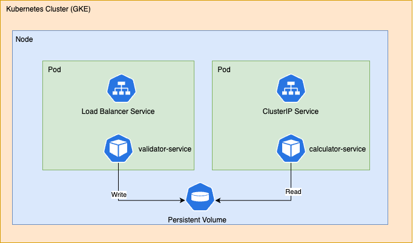
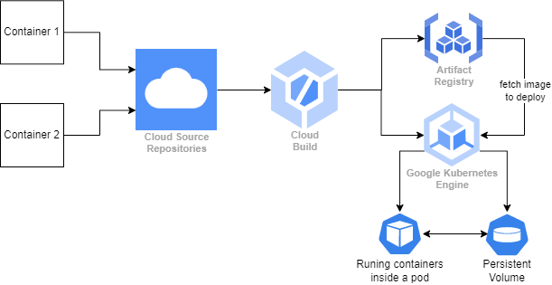

# Kubernetes-microservices-pipeline

This project demonstrates an end-to-end microservices architecture deployed on Google Cloud Platform (GCP), with container orchestration managed by Kubernetes. Infrastructure provisioning is handled seamlessly using Terraform, while a robust continuous integration/continuous delivery (CI/CD) pipeline ensures efficient development and deployment processes.

## Kubernetes Cluster
The architecture comprises a Kubernetes cluster (GKE) with a single node. Within this cluster, there are two pods: one for the validator service, responsible for data validation, and another for the calculator service, which performs computations. The validator service is publicly accessible, featuring a Load Balancer Service, while access to the calculator service is restricted to within the cluster, facilitated by a ClusterIP service. Additionally, a Persistent Volume is attached to persist data, ensuring accessibility to containers across different pods/nodes.

## Application Workflow

## GCP Cloud Services

* Google Kubernetes Engine
* Artifact Registry
* Cloud Source Repository
* Cloud Build (CI/CD service)
* Terraform (Infrastructure provisioning)

